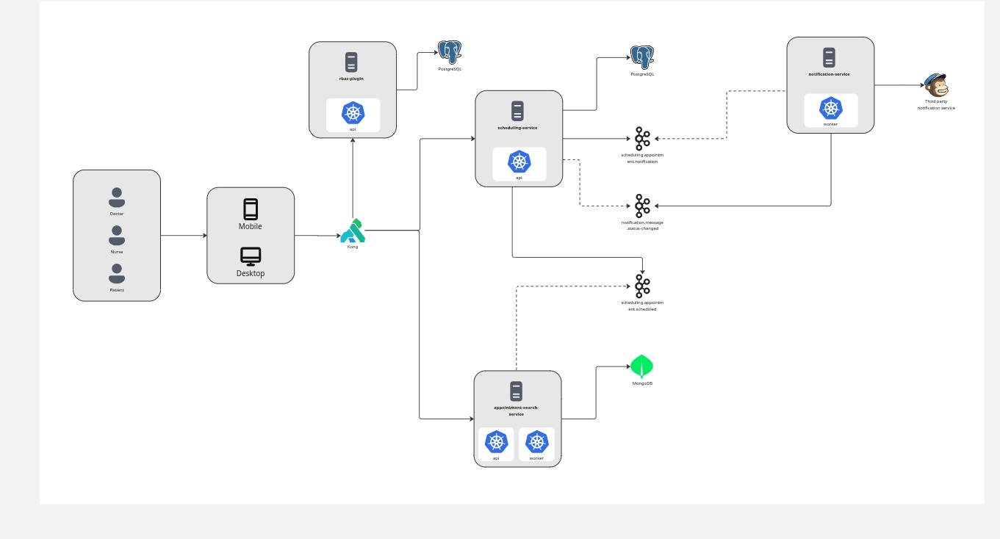
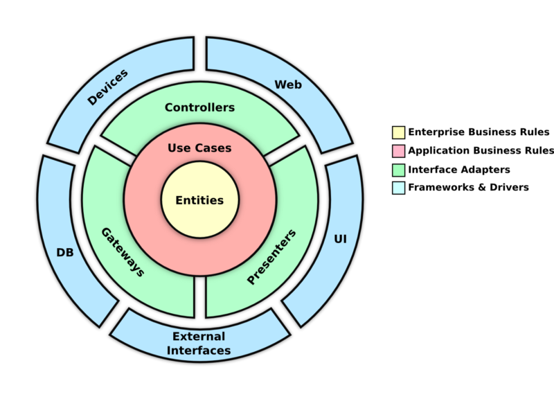

# Appointment Search Service

Microsservico de consulta de agendamentos do ecossistema de saude. Atua como **read model** do dominio de scheduling, recebendo eventos via Kafka, persistindo projeções em MongoDB e expondo consultas flexiveis via GraphQL.

## Visao geral

O projeto segue o padrao **CQRS** com dois perfis de execucao separados:

- **API (`api`)**: atende consultas GraphQL e aplica seguranca com base nos headers injetados pelo Kong.
- **Worker (`worker`)**: consome eventos do Kafka e atualiza as projeções no MongoDB.

Essa separacao reduz acoplamento operacional e permite escalar leitura e ingestao de eventos de forma independente.

## Stack

- Java 21
- Spring Boot 4.0.8
- Spring Web
- Spring GraphQL
- Spring Data MongoDB
- Spring Kafka
- Spring Security
- Spring Actuator
- Resilience4j
- MongoDB
- Docker e Docker Compose

## Arquitetura

### Instancia API

- expõe o endpoint GraphQL em `/graphql`
- roda com `spring.main.web-application-type=servlet`
- valida contexto de usuario via `X-User-Roles` e `X-User-ID`
- devolve erros GraphQL via `DataFetcherExceptionResolver`

### Instancia Worker

- roda com `spring.main.web-application-type=none`
- ativa Kafka somente no perfil `worker`
- consome eventos do topico `scheduling.appointment.scheduled`
- aplica retry e DLQ para falhas de processamento

## Diagramas

### Arquitetura da solucao



### Arquitetura limpa



## Contrato GraphQL

O schema fica em `src/main/resources/graphql/schema.graphqls` e define:

- `appointmentsByPatient(patientId, filter)`
- `myAppointments(filter)`

Filtro suportado:

- `from`
- `to`
- `page`
- `size`

Scalars utilizados:

- `DateTime`
- `Long`

## Seguranca e acesso

O Kong injeta o contexto de usuario via headers HTTP:

- `X-User-Roles`
- `X-User-ID`

Regras principais:

- pacientes acessam apenas o proprio historico
- `DOCTOR`, `NURSE` e `ADMIN` podem consultar qualquer paciente
- acessos negados retornam erro GraphQL com codigo `FORBIDDEN`

## Execucao local

### Banco

Suba apenas o MongoDB e o Mongo Express:

```bash
docker compose up -d mongodb mongo-express
```

### API

```bash
./mvnw spring-boot:run -Dspring-boot.run.profiles=api
```

### Worker

```bash
./mvnw spring-boot:run -Dspring-boot.run.profiles=worker
```

## Testes e build

```bash
./mvnw test
./mvnw clean test
./mvnw clean package -DskipTests
```

## Endpoints uteis

- GraphQL: `POST /graphql`
- Health check: `GET /actuator/health`
- Info: `GET /actuator/info`

## Variaveis de ambiente

- `SERVER_PORT`
- `SPRING_DATA_MONGODB_URI`
- `SPRING_DATA_MONGODB_DATABASE`
- `SPRING_KAFKA_BOOTSTRAP_SERVERS`
- `SPRING_KAFKA_CONSUMER_GROUP_ID`

## Estrutura resumida

- `src/main/java/` - codigo-fonte da aplicacao
- `src/main/resources/application.yaml` - configuracao base
- `src/main/resources/application-api.yaml` - configuracao do perfil API
- `src/main/resources/application-worker.yaml` - configuracao do perfil Worker
- `src/main/resources/graphql/schema.graphqls` - schema GraphQL
- `docker-compose.yml` - MongoDB e Mongo Express para ambiente local

## Observacoes

- O perfil `api` e o perfil padrao da aplicacao.
- O worker depende de um broker Kafka disponivel no ambiente.
- O projeto usa MongoDB como base de leitura e projecao.
